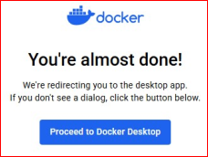

# Deploying Containerized Applications to the Cloud: Step by Step

This guide provides step-by-step instructions for deploying containerized applications to the cloud using Docker, Kubernetes, and Google Cloud Services.

## Prerequisites
- Docker installed on your local machine
- Cloud provider account (AWS, Azure, GCP, etc.)
- CLI tools installed (AWS CLI, Azure CLI, GCloud CLI, kubectl, etc.)
- Basic knowledge of containerization and cloud services


## Step 1: Create an Account in docker.com / Download and install Docker Desktop
- Go to https://www.docker.com/
- Sign up / Sign in
- Download and install Docker Desktop from the same address.

<p align="center">
  <br>
  <br>
  <br>
  <br>
  <br>
  <br>
  <br>
  <br>
  <br>
</p>


## Step 1: Build a Docker Image
```bash
# Navigate to your project directory
cd my-app

# Build the Docker image
docker build -t my-app:latest .

# Verify the image
docker images
```


## Step 2: Push the Image to a Container Registry
Choose a cloud registry (Docker Hub, AWS ECR, GCP Artifact Registry, Azure Container Registry).

```bash
# Log in to the container registry
aws ecr get-login-password | docker login --username AWS --password-stdin <aws-account-id>.dkr.ecr.<region>.amazonaws.com

docker tag my-app:latest <registry-url>/my-app:latest

docker push <registry-url>/my-app:latest
```


## Step 3: Deploy to Kubernetes (Optional)
If using Kubernetes, deploy the container using a YAML file.

```yaml
apiVersion: apps/v1
kind: Deployment
metadata:
  name: my-app
spec:
  replicas: 2
  selector:
    matchLabels:
      app: my-app
  template:
    metadata:
      labels:
        app: my-app
    spec:
      containers:
        - name: my-app
          image: <registry-url>/my-app:latest
          ports:
            - containerPort: 80
```
```bash
kubectl apply -f deployment.yaml
```


## Step 4: Expose the Application
```bash
kubectl expose deployment my-app --type=LoadBalancer --port=80
```
Find the external IP and access your application.


## Step 5: Verify Deployment
- Check the logs:
  ```bash
  kubectl logs -f deployment/my-app
  ```
- Open the application in the browser:
  ```bash
  kubectl get services
  ```

## Conclusion
You have successfully deployed a containerized application to the cloud! 🎉

For troubleshooting, refer to your cloud provider's documentation or Kubernetes docs.

---
**Next Steps:**
- Configure CI/CD pipelines
- Implement monitoring and logging
- Optimize container scaling
