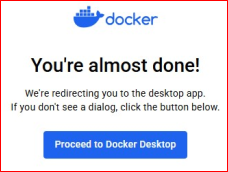
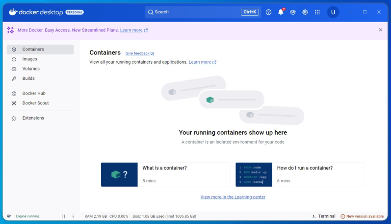
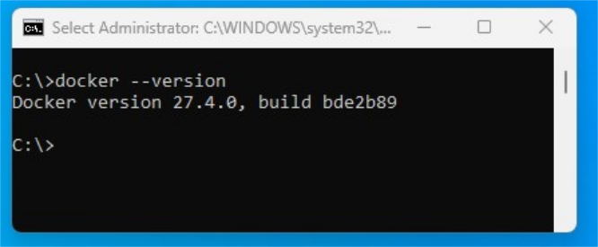
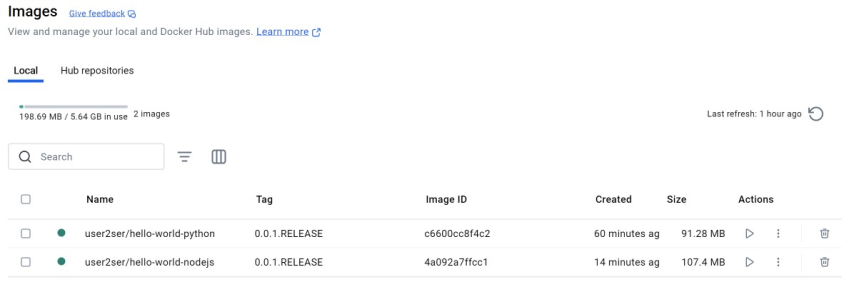
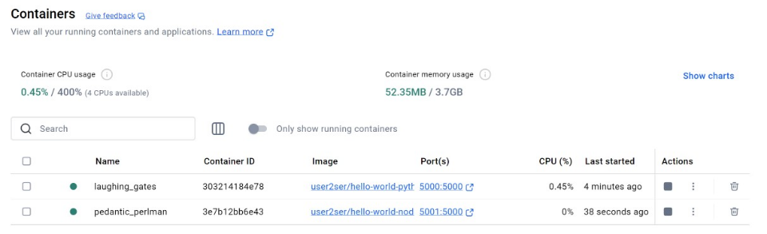
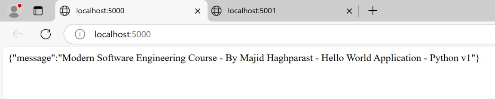
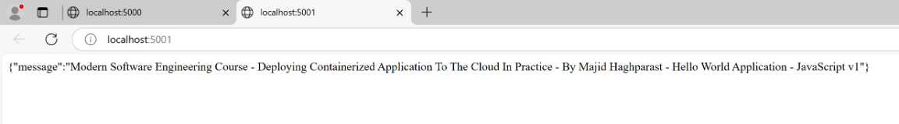
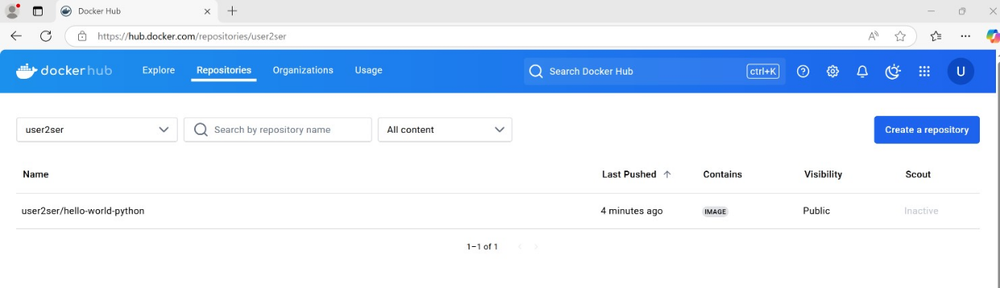
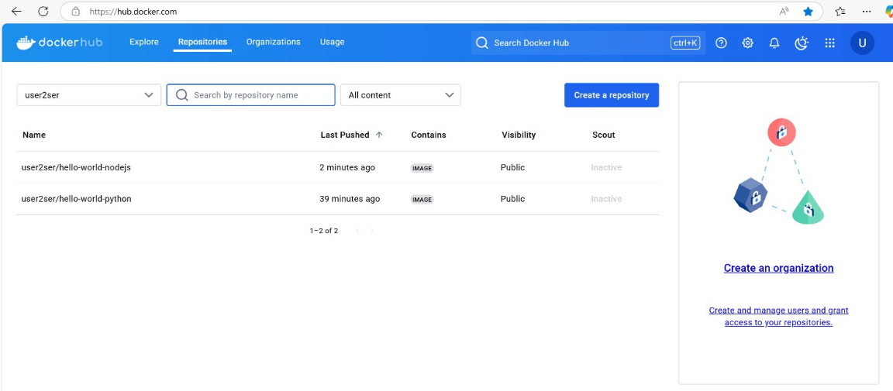

# Deploying Containerized Applications to the Cloud: Step by Step

This guide provides step-by-step instructions for deploying containerized applications to the cloud using Docker, Kubernetes, GKE, and Google Cloud Services.

## Prerequisites
- Basic programming skills (e.g., Python or JavaScript)
- Some familiarity with web development (HTML, and JavaScript).


## Step 1: Create an Account in docker.com / Download and install Docker Desktop
- Go to https://www.docker.com/
- Sign up / Sign in
- Download and install Docker Desktop from the same address.

<p align="center">
  <br>
  <br>
  <br>
  <br>
  <br>
  <br>
  <br>
  <br>
  <br>
</p>

- After installing Docker Desktop on your PC, you can verify the installation by running the following command in the terminal:
```bash
docker --version
```

<p align="center">
  <br>
</p>


## Step 2: Prepare Your Application

- Ensure your application is container-ready by creating a `Dockerfile`.  
- This file defines the environment and dependencies required for your application.

We provide two example applications:

### 🐍 Python Application

The following `Dockerfile` sets up a Python application using Alpine Linux:

```dockerfile
FROM python:alpine3.10
WORKDIR /app
COPY . /app
RUN pip install -r requirements.txt
EXPOSE 5000
CMD python ./launch.py
```

### 🟨 JavaScript Application (Node.js)

The following `Dockerfile` sets up a Node.js application using Alpine Linux:

```dockerfile
FROM node:8.16.1-alpine
WORKDIR /app
COPY . /app
RUN npm install
EXPOSE 5000
CMD node index.js
```

## Step 3: Build Docker Images and Run Docker Containers 

After creating the `Dockerfile`, you can build Docker Images and test(run) the Docker Containers using the following commands in the Terminal:

### Python Application

```sh
C:\ModernSE-DevOps\projects\hello-world\hello-world-python> docker build -t user2ser/hello-world-python:0.0.1.RELEASE .
C:\ModernSE-DevOps\projects\hello-world\hello-world-python> docker run -p 5000:5000 -d user2ser/hello-world-python:0.0.1.RELEASE
```

### JavaScript Application

```sh
C:\ModernSE-DevOps\projects\hello-world\hello-world-nodejs> docker build -t user2ser/hello-world-nodejs:0.0.1.RELEASE .
C:\ModernSE-DevOps\projects\hello-world\hello-world-nodejs> docker run -p 5001:5000 -d user2ser/hello-world-nodejs:0.0.1.RELEASE
```

Now, your applications are running inside Docker containers and accessible on ports `5000` and `5001` on your local host. 🚀

- If you check the Image section in your Docker Desktop, you will see:


<p align="center">
  <br>
</p>


- If you check the Container section in your Docker Desktop, you will see:


<p align="center">
  <br>
</p>

- If you click the links, you can see the websites are working:

- Python Application 
<p align="center">
  <br>
</p>

- Javascript Application 
<p align="center">
  <br>
</p>


## Step 4: Push the Docker Images to the Docker Hub (Container Registry)
Push the docker images to the Container Registry using the following commands in the Terminal.


### Python Application

```sh
C:\ModernSE-DevOps\projects\hello-world\hello-world-python> docker push user2ser/hello-world-python:0.0.1.RELEASE
```


<p align="center">
  <br>
</p>


### JavaScript Application

```sh
C:\ModernSE-DevOps\projects\hello-world\hello-world-nodejs> docker push user2ser/hello-world-nodejs:0.0.1.RELEASE
```


<p align="center">
  <br>
</p>


Now, your applications are pushed to the docker hub. 🚀


## Step 5: Create Google Cloud Account
Now you can follow the instructions to create Google Cloud Account:


<p align="center">
  <br>
</p>


<p align="center">
  <br>
</p>


<p align="center">
  <br>
</p>


<p align="center">
  <br>
</p>


Google Cloud Console is like this:


<p align="center">
  <br>
</p>


Now search for GKE (Google Kubernetes Engine):


<p align="center">
  <br>
</p>

You need to enable Kubernetes Engine API:
<p align="center">
  <br>
</p>

The Kubernetes Engine interface is like this:

<p align="center">
  <br>
</p>


## Step 6: Create Cluster
- Cluster contains Control Plane and Worker Nodes
- We run applications in the Kubernetes Cluster


<p align="center">
  <br>
</p>


<p align="center">
  <br>
</p>


<p align="center">
  <br>
</p>


## Step 7: Connect to the Kubernetes Cluster
- In order to connect to the Kubernetes Cluster, click "Connect".


<p align="center">
  <br>
</p>

- Then copy the Text

```bash
gcloud container clusters get-credentials mse-cluster-01 --region europe-north1 --project artful-timing-450701-a3
```

<p align="center">
  <br>
</p>

- Now open the terminal
- Paste the Text and Press Enter


<p align="center">
  <br>
</p>

- Verify the connection to the Kubernetes cluster by the following command:
```bash
Kubectl version
```

<p align="center">
  <br>
</p>


## Step 8: Deploy the containerized applications to the Cloud and expose services to the world

We have two applications:

### 🐍 Python Application

Run the following commands in the Terminal:

```bash
kubectl create deployment hello-world-python --image=user2ser/hello-world-python:0.0.1.RELEASE
kubectl expose deployment hello-world-python --type=LoadBalancer --port=5000
```

<p align="center">
  <br>
</p>

### 🟨 JavaScript Application (Node.js)

Run this command in the Terminal:

```bash
kubectl create deployment hello-world-nodejs --image=user2ser/hello-world-nodejs:0.0.1.RELEASE
kubectl expose deployment hello-world-nodejs --type=LoadBalancer --port=5001
```


<p align="center">
  <br>
</p>


## Results
Find the external IP and access your applications:
<br>

<p align="center">
  <br>
</p>

<p align="center">
  <br>
</p>


- Python Application is deployed here: <a href="http://34.88.217.12:5000/" target="_blank">http://34.88.217.12:5000/</a>

- Javascript Application is deployed here: <a href="http://35.228.114.70:5001/" target="_blank">http://35.228.114.70:5001/</a>

<br>


## Conclusion
You have successfully deployed two different containerized applications to the cloud! 🎉

---
**Next Steps:**
- Deep dive into the Docker Commands
- Deep dive into the Kubernetes Commands
- Configure CI/CD pipelines
