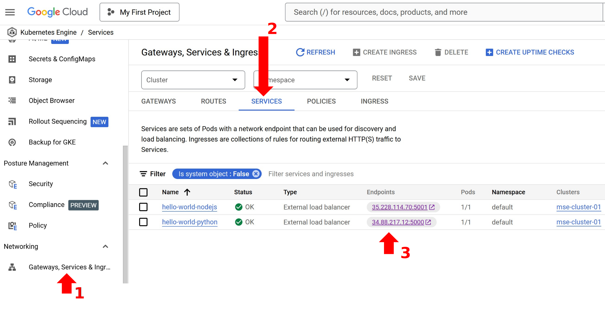

# Deploying Containerized Applications to the Cloud: Step 5 to Step 8

- Here, I will provide step-by-step instructions for deploying containerized applications to the cloud using Docker, Kubernetes, GKE, and Google Cloud Services.

## Previous lecture:
- In the last session, I explained Steps #1 to #4.
- You can review them here: https://github.com/MajidHaghparast/MSE/blob/main/lectures/Lecture%2013-2-2025.md
- Step 1: Create an Account in a Container Registry / Download and install Docker Desktop
- Step 2: Prepare Your Application
- Step 3: Build Docker Images and Run Docker Containers 
- Step 4: Push the Docker Images to the Container Registry

## This lecture:
- In this lecture (Through steps 5 to 8), we will learn how to deploy containerized applications to the cloud.

## Step 5: Create Google Cloud Account
Now, you can follow the instructions to create a Google Cloud account.


<p align="center">
  <br>
</p>


<p align="center">
  <br>
</p>


<p align="center">
  <br>
</p>


<p align="center">
  <br>
</p>


Google Cloud Console is like this:


<p align="center">
  <br>
</p>


Now search for GKE (Google Kubernetes Engine):


<p align="center">
  <br>
</p>

You need to enable Kubernetes Engine API:
<p align="center">
  <br>
</p>

The Kubernetes Engine interface is like this:

<p align="center">
  <br>
</p>


## Step 6: Create Cluster
- Cluster contains Control Plane and Worker Nodes
- We run applications in the Kubernetes Cluster


<p align="center">
  <br>
</p>


<p align="center">
  <br>
</p>


<p align="center">
  <br>
</p>


## Step 7: Connect to the Kubernetes Cluster
- In order to connect to the Kubernetes Cluster, click "Connect".


<p align="center">
  <br>
</p>

- Then copy the Text

```bash
gcloud container clusters get-credentials mse-cluster-01 --region europe-north1 --project artful-timing-450701-a3
```

<p align="center">
  <br>
</p>

- Now open the terminal
- Paste the Text and Press Enter


<p align="center">
  <br>
</p>

- Verify the connection to the Kubernetes cluster by the following command:
```bash
Kubectl version
```

<p align="center">
  <br>
</p>


## Step 8: Deploy the containerized applications to the Cloud and expose services to the world

We have two applications:

### 🐍 Python Application

Run the following commands in the Terminal:

```bash
kubectl create deployment hello-world-python --image=user2ser/hello-world-python:0.0.1.RELEASE
kubectl expose deployment hello-world-python --type=LoadBalancer --port=5000
```

<p align="center">
  <br>
</p>

### 🟨 JavaScript Application (Node.js)

Run this command in the Terminal:

```bash
kubectl create deployment hello-world-nodejs --image=user2ser/hello-world-nodejs:0.0.1.RELEASE
kubectl expose deployment hello-world-nodejs --type=LoadBalancer --port=5001
```


<p align="center">
  <br>
</p>


## Results
Find the external IP and access your applications:
<br>

<p align="center">
  <br>
</p>


- Python Application is deployed here: <a href="http://34.88.217.12:5000/" target="_blank">http://34.88.217.12:5000/</a>

- Javascript Application is deployed here: <a href="http://35.228.114.70:5001/" target="_blank">http://35.228.114.70:5001/</a>

<br>

<p align="center">
  <br>
</p>


## Conclusion
You have successfully deployed two different containerized applications to the cloud! 🎉

---
**Next Steps:**
- Deep dive into the Docker Commands
- Deep dive into the Kubernetes Commands
- Configure CI/CD pipelines
